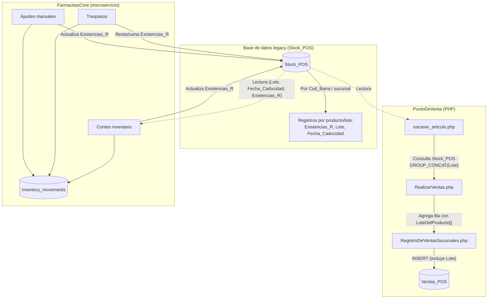
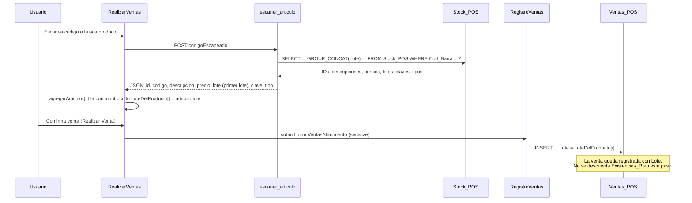
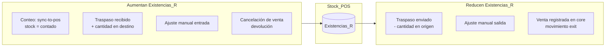
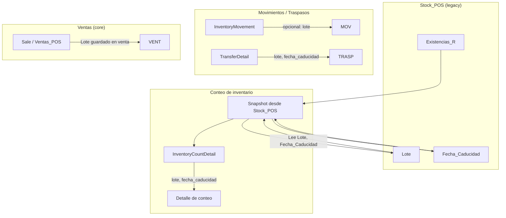

# Diagrama: Caducidades, Lotes y Stock en PuntoDeVenta

Este documento describe cómo se manejan **caducidades**, **lotes** y **stock** dentro del PuntoDeVenta (POS) y su relación con el sistema legacy y el microservicio FarmacitasCore.

---

## 1. Fuente de datos: tabla `Stock_POS` (legacy)

La tabla **Stock_POS** es la fuente principal de existencia por sucursal. Puede haber **varios registros por mismo producto** (uno por lote/caducidad).

| Campo relevante   | Descripción |
|-------------------|-------------|
| `Cod_Barra`       | Código de barras del producto |
| `Fk_sucursal`     | Sucursal |
| `ID_Prod_POS`     | ID del producto en Productos_POS |
| `Nombre_Prod`     | Nombre del producto |
| `Existencias_R`   | **Stock actual** (cantidad en existencia) |
| `Lote`            | **Lote** del producto |
| `Fecha_Caducidad` | **Fecha de caducidad** |
| `Precio_Venta` / `Precio_C` | Precios |
| `Folio_Prod_Stock`| Identificador único del registro en Stock_POS |

---

## 2. Flujo general: de Stock_POS a venta y movimientos

---

## 3. Cómo se usan Lote y Caducidad en el POS (PHP)

**Resumen POS PHP:**

- **Lote:** Se obtiene de `Stock_POS` en `escaner_articulo.php` (primer lote si hay varios por `Cod_Barra`). Se envía en la fila como `LoteDelProducto[]` y se guarda en `Ventas_POS.Lote`.
- **Caducidad:** En el flujo actual del POS PHP **no** se consulta ni se muestra `Fecha_Caducidad`; solo se usa en el microservicio (conteos, reportes, traspasos).
- **Stock:** El POS solo **lee** existencia desde `Stock_POS` para mostrar producto/precio; **no actualiza** `Existencias_R` al registrar la venta. La actualización de stock se hace desde FarmacitasCore (conteo, traspasos, ajustes) o por otros procesos.

---

## 4. Cómo se maneja el stock (Existencias_R)

- **POS PHP:** Inserta en `Ventas_POS` (con `Lote` y cantidad). No toca `Existencias_R`.
- **FarmacitasCore:**  
  - **Conteo:** Al sincronizar conteo con POS (`sync-to-pos`), se actualiza `Existencias_R` al valor contado.  
  - **Traspasos:** Al completar traspaso, se resta cantidad en origen y se suma en destino en `Stock_POS`.  
  - **Ajustes:** Los ajustes manuales de inventario actualizan `Existencias_R`.  
  - **Ventas:** Si las ventas se registran o sincronizan desde el core, se pueden generar movimientos de tipo `exit` y en ese flujo podría actualizarse stock; el registro directo desde el POS PHP no actualiza `Stock_POS`.

---

## 5. Caducidades y Lotes en el microservicio (FarmacitasCore)

- **Conteo:** Al crear un conteo se hace un snapshot de `Stock_POS`; cada ítem puede llevar `Lote` y `Fecha_Caducidad`. Se valida `Fecha_Caducidad` (por ejemplo se rechazan fechas inválidas como `0000-00-00`).
- **Traspasos:** Los detalles de traspaso pueden llevar `lote` y `fecha_caducidad`; al sincronizar con legacy se actualiza `Stock_POS` (Existencias_R) en origen y destino.
- **Ventas:** En el modelo de ventas del core se guarda el campo `lote`; las ventas registradas desde el POS PHP ya incluyen ese lote en `Ventas_POS`.

---

## 6. Resumen en una sola vista

| Área              | Lote | Fecha caducidad | Stock (Existencias_R) |
|-------------------|------|------------------|------------------------|
| **Stock_POS**     | Sí, por registro | Sí, por registro | Sí, valor actual |
| **POS PHP – escaneo** | Sí, se lee (primer lote) | No se usa | Solo lectura |
| **POS PHP – venta**  | Sí, se guarda en Ventas_POS | No | No se actualiza |
| **FarmacitasCore – conteo** | Sí, en detalle de conteo | Sí, validada | Se actualiza al sincronizar |
| **FarmacitasCore – traspasos** | Sí, en detalle | Sí | Se actualiza origen/destino |
| **FarmacitasCore – ajustes**   | — | — | Se actualiza |
| **Movimientos de inventario** | Opcional en movimiento | — | Reflejan stock_before/stock_after |

---

## 7. Archivos de referencia

| Qué | Dónde |
|-----|--------|
| Lectura de producto y lote en POS | `PuntoDeVentaFarmacias/Controladores/escaner_articulo.php` |
| Formulario de venta (LoteDelProducto) | `PuntoDeVentaFarmacias/RealizarVentas.php` |
| Registro de venta con Lote | `PuntoDeVentaFarmacias/Controladores/RegistroDeVentasSucursales.php` |
| Envío del formulario al registrar venta | `PuntoDeVentaFarmacias/js/FinalizaLasVentasSucursalesS.js` |
| Conteo y snapshot Stock_POS (Lote, Fecha_Caducidad) | `Microservices/FarmacitasCore/app/api/v1/inventory.py` |
| Traspasos y actualización Stock_POS | `Microservices/FarmacitasCore/app/services/transfer_service.py` |
| Lógica de movimientos de inventario | `LOGICA_MOVIMIENTOS_INVENTARIO.md` |

Si quieres, el siguiente paso puede ser añadir un diagrama de “qué habría que cambiar para que el POS PHP descuente stock al vender” o para mostrar caducidad en pantalla.
